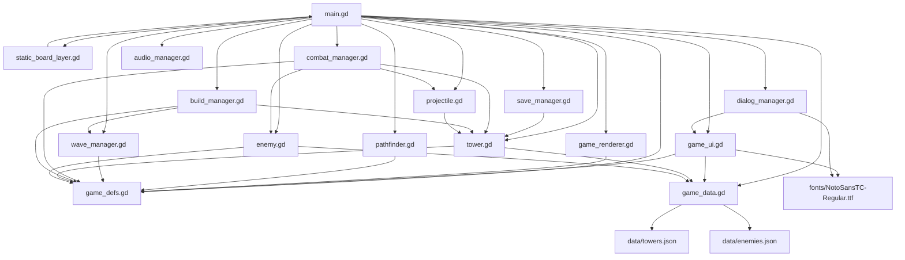

# Path Bender Tower Defense - 遊戲邏輯說明

本文說明目前 `Beta 0.7.2` 的主要運行流程、檔案職責，以及 `main.gd` 與各 `.gd` 檔案之間的調用關係。這份文件的目標是讓後續調整畫面精細度、塔造型、子彈、敵人種類、場景、平衡與 Web 效能時，可以快速找到該改哪裡。

## 專案概覽

- 敵人從左側入口往右側出口移動。
- 玩家建造 `2x2` 塔來改變敵人路線。
- 建塔可以延長路徑，但不能完全堵死入口到出口。
- 敵人可 8 方向移動，包含斜線，但不能斜穿過被塔封住的角落。
- 第 50 波是最後一波，通過後會出現攻擊量審查員並記錄排行榜。
- Web 版已加入分層繪製、字型子集、Netlify 自動部署、版本化資源與高負載低畫質模式。

## 維護文件索引

- `docs/ONBOARDING.md`：新接手者如何執行、測試、部署與定位修改位置。
- `docs/DATA_SCHEMA.md`：`data/towers.json`、`data/enemies.json` 欄位說明。
- `docs/ARCHITECTURE_DECISIONS.md`：重要架構決策與為什麼這樣設計。
- `docs/ROADMAP.md`：後續開發階段、完成標準與暫緩項目。
- `docs/PERFORMANCE_GUIDE.md`：Web 與後期大量物件效能規則。
- `docs/CHANGELOG.md`：每個版本的修改紀錄。
- `docs/NEXT_PROJECT_CHECKLIST.md`：下個新專案可提前規劃的經驗清單。

## 目前檔案職責

```text
scripts/main.gd              主流程、遊戲狀態、輸入、敵人移動、流程協調
scripts/game_defs.gd         共用常數：地圖、類型、畫面狀態、版本號
scripts/game_data.gd         讀取資料表，提供塔與敵人數值查詢
scripts/game_ui.gd           UI 建立、按鈕連接、版面配置、HUD 文字更新
scripts/game_renderer.gd     畫面繪製：靜態層、動態層、塔、敵人、子彈、特效
scripts/static_board_layer.gd 靜態繪製層節點，回呼 main.gd 繪製靜態畫面
scripts/pathfinder.gd        路徑搜尋、防堵路、斜線移動限制
scripts/wave_manager.gd      波次、難度、出怪節奏、敵人種類選擇
scripts/save_manager.gd      存檔、讀檔、meta/排行榜資料
scripts/combat_manager.gd    塔攻擊、子彈移動、命中、傷害、目標搜尋
scripts/build_manager.gd     建塔、拆塔、升級、升到最高等
scripts/audio_manager.gd     音效建立、背景音樂生成、音量套用
scripts/dialog_manager.gd    自製確認視窗，避免 Web 中文亂碼
scripts/tower.gd             單座塔的資料、升級與數值套用
scripts/enemy.gd             單隻敵人的資料、速度、血量、復活、狀態效果
scripts/projectile.gd        子彈資料：位置、目標、傷害、緩速、濺射
data/towers.json             塔數值資料表
data/enemies.json            敵人數值資料表
scenes/main.tscn             Godot 主場景
project.godot                Godot 專案設定
```

目前 `main.gd` 仍是遊戲流程中樞，但戰鬥、建造、音效、對話框、UI、繪圖、路徑、波次、存檔、資料讀取都已拆到獨立檔案。後續新增內容時，優先改對應 manager，不要再把細節塞回 `main.gd`。

## 主調用關係



## `main.gd` 的角色

`main.gd` 現在主要負責：

- 保存全局遊戲狀態：金幣、生命、波數、塔、敵人、子彈、路徑、UI 狀態。
- Godot 生命週期：`_ready()`、`_process()`、`_unhandled_input()`、`_draw()`。
- 流程協調：呼叫各 manager。
- 敵人移動與死亡處理。
- 畫面狀態與 render state 組裝。

`main.gd` 保留很多 wrapper，例如：

```gdscript
func _update_towers(delta: float) -> void:
	CombatManager.update_towers(self, delta)

func try_build_or_select(cell: Vector2i) -> void:
	BuildManager.try_build_or_select(self, cell)

func _apply_audio_settings() -> void:
	AudioManager.apply_settings(self)

func popup_confirmation(title: String, text: String, confirmed_action: Callable) -> void:
	DialogManager.popup_confirmation(self, title, text, confirmed_action)
```

這樣既能讓 UI 和流程呼叫保持穩定，也能把細節放到獨立檔案。

## 啟動流程

Godot 啟動順序：

1. Godot 載入 `project.godot`。
2. `run/main_scene` 指向 `res://scenes/main.tscn`。
3. `main.tscn` 建立主節點。
4. 主節點掛載 `scripts/main.gd`。
5. Godot 呼叫 `_ready()`。

`_ready()` 主要流程：

```gdscript
static_board_layer.owner_node = self
add_child(static_board_layer)
add_child(ui_layer)
_build_audio()
_build_ui()
_connect_ui()
_load_meta_data()
_reset_game_state()
show_screen(Defs.SCREEN_MENU)
set_process(true)
```

對外調用：

- `_build_audio()` -> `AudioManager.build(self)`
- `_build_ui()` -> `GameUI.build(self)`
- `_connect_ui()` -> `GameUI.connect_buttons(self)`
- `_load_meta_data()` -> `SaveManager.apply_loaded_data(self)`
- `show_screen(...)` -> `GameUI.show_screen(self, screen)`

## 每幀主流程

Godot 每幀呼叫：

```gdscript
func _process(delta: float) -> void
```

流程：

1. `_update_layout()`
   - 轉呼叫 `GameUI.update_layout(self)`。
   - 更新 `cell_size`、`grid_origin`、`grid_rect`。
2. `update_static_layer_if_needed()`
   - 比對靜態層簽名。
   - 地圖、路徑、塔底座、格線、Boss 底色等有變才重畫靜態層。
3. `_update_hover_cell()`
   - 只有滑鼠移到新格子時才重新檢查建造預覽與防堵路。
4. 如果目前是遊戲畫面、未結束、且沒有確認視窗：
   - `_update_spawn(game_delta)` -> `WaveManager.update_spawn(self, delta)`
   - `_update_enemies(game_delta)`
   - `_update_towers(game_delta)` -> `CombatManager.update_towers(self, delta)`
   - `_update_projectiles(game_delta)` -> `CombatManager.update_projectiles(self, delta)`
5. 更新訊息、出生點發光、波次提示、生命閃爍、飄字、衝擊波。
6. `_update_ui()`
   - 先比對 UI 狀態簽名。
   - 狀態有變才呼叫 `GameUI.update(self)`。
7. `queue_redraw()` 要求 Godot 下一次呼叫 `_draw()`。

`game_delta = delta * game_speed`，所以速度按鈕會影響敵人移動、塔攻擊、子彈移動與生成節奏。

確認視窗開啟時：

- `confirmation_dialog_open = true`
- `_process()` 不會跑出怪、敵人、塔、子彈更新
- 倒數不會繼續扣秒

## UI 流程

畫面狀態由 `current_screen` 控制：

```text
SCREEN_MENU
SCREEN_RULES
SCREEN_RANKING
SCREEN_DIFFICULTY
SCREEN_GAME
```

`GameUI.show_screen(owner, screen)` 會：

1. 設定 `owner.current_screen`。
2. 清掉 `owner.last_viewport_size`，強制重新 layout。
3. 呼叫 `update_layout(owner)`。
4. 顯示或隱藏 menu/rules/ranking/difficulty/game UI。
5. 呼叫 `update(owner)` 更新文字與按鈕狀態。
6. 呼叫 `owner.queue_redraw()`。

按鈕連接在 `GameUI.connect_buttons(owner)`：

- `開始遊戲` -> `owner.start_new_game()`
- `繼續遊戲` -> `owner.load_saved_game()`
- `操作規則` -> `owner.show_screen(Defs.SCREEN_RULES)`
- `排行榜` -> `owner.show_screen(Defs.SCREEN_RANKING)`
- `難度調整` -> `owner.show_screen(Defs.SCREEN_DIFFICULTY)`
- `下一波` -> `owner.start_wave()`
- `砲塔/箭塔/冰凍塔` -> `owner.select_build_type(...)`
- `1x/2x/4x/8x/16x` -> `owner.set_game_speed(...)`
- `存檔` -> `owner.save_game()`
- `回主選單` -> `owner.confirm_return_to_menu()`
- `退出` -> `owner.confirm_exit_game()`
- `顯示敵人路徑` -> 更新 `show_enemy_path` 並重畫靜態層
- `自動開始` -> 更新 `auto_start_enabled`
- `音樂/音效` -> 更新 audio 設定

UI 文字更新有 `ui_update_signature`，沒有狀態變動時不重刷 Label/Button。

## 對話視窗流程

確認視窗由 `DialogManager` 自製，不使用 Godot 內建 `ConfirmationDialog`，避免 Web 版中文內文亂碼。

調用關係：

```text
main.gd confirm_return_to_menu()
-> main.gd popup_confirmation(...)
-> DialogManager.popup_confirmation(owner, title, text, confirmed_action)
```

自製視窗內容：

- 半透明遮罩
- Panel
- 標題 Label
- 內文 Label
- `確定` / `取消` 按鈕
- 全部套用 `fonts/NotoSansTC-Regular.ttf`

視窗開啟時 `confirmation_dialog_open = true`，遊戲更新會暫停。

## 繪圖流程

目前繪圖分成靜態層與動態層。

Godot 呼叫：

```gdscript
func _draw() -> void:
	GameRenderer.render_dynamic(self, render_state())

func _draw_static_layer(canvas: Node2D) -> void:
	GameRenderer.render_static(canvas, render_state())
```

`static_board_layer.gd` 的 `_draw()` 會回呼：

```gdscript
owner_node._draw_static_layer(self)
```

靜態層繪製：

- 背景
- 格線
- 建造地板
- 敵人路徑
- 塔底座
- 冰凍塔外觀
- 塔等級紅點 / 星星

動態層繪製：

- 出生點發光
- 建造 hover 預覽
- 選取塔範圍
- 砲塔砲管 / 箭塔發射臂
- 敵人
- 子彈
- 衝擊波
- 飄字
- 波次提示
- 遊戲結束遮罩

靜態層重畫條件由 `build_static_layer_signature()` 決定，包含：

- 畫面大小
- `grid_origin`
- `cell_size`
- `grid_rect`
- blocked cells
- current path
- 是否顯示敵人路徑
- Boss 波底色狀態

## 高負載自動低畫質模式

`game_renderer.gd` 會根據 `visual_load` 降低繪製負擔。

`visual_load()` 目前是：

```gdscript
return enemies.size() + projectiles.size() + impact_waves.size()
```

降載規則：

- 中負載：一般敵人血條隔隻顯示。
- 高負載：不繪製子彈，傷害仍照算。
- 高負載：一般敵人不顯示血條，只保留 Boss 與審查員。
- 忙碌狀態：選取塔射程圈不畫大面積半透明填色，只畫外框。
- `4x`、`8x`、`16x`：不繪製子彈與怪物血條。

這些只影響視覺，不改遊戲規則、傷害、命中或波次。

## 建造系統

入口仍在 `main.gd`：

```text
_unhandled_input()
├─ 滑鼠左鍵
│  -> world_to_cell(mouse_pos)
│  -> build_confirm_enabled ? handle_touch_primary_action(cell) : try_build_or_select(cell)
└─ 觸控點擊
   -> world_to_cell(touch_pos)
   -> build_confirm_enabled ? handle_touch_primary_action(cell) : try_build_or_select(cell)
```

`build_confirm_enabled` 預設為 `true`。右側操作區的 `建造確認` checkbox 可切換這個值：

- 開啟：第一次點空地顯示半透明塔預覽，第二次點半透明 `2x2` 範圍內任一格開始建造時間，進度滿後才呼叫 `try_build_or_select(cell)`。
- 關閉：回到點一下直接建造。

`BuildManager.validate_build(owner, cell)` 集中檢查能不能建造，會回傳：

- `ok`: 是否可建造。
- `message`: 不可建造時的提示文字。
- `path`: 可建造時的新路徑。

`BuildManager.try_build_or_select(owner, cell)` 判斷順序：

1. 如果點到既有塔，設定 `selected_tower`。
2. 呼叫 `BuildManager.validate_build(owner, cell)`。
3. 如果波次進行中，拒絕建造。
4. `owner.can_place_footprint(cell)` 檢查 `2x2` 佔地是否在地圖內且未被占用。
5. `owner.tower_cost(owner.selected_build_type)` 查資料表價格。
6. 金幣不足則 `owner.reject_build(...)`。
7. `owner.footprint_has_enemy(cell)` 檢查欲建造區塊是否有敵人。
8. 複製 `owner.blocked` 成 `test_blocked`。
9. 把欲建造的 `2x2` 區塊加入 `test_blocked`。
10. 呼叫 `owner.find_path(test_blocked)`。
11. 如果無路，拒絕建造並播放錯誤音。
12. 建立 `Tower.new(cell, owner.selected_build_type)`。
13. 將塔加入 `owner.towers`。
14. 更新 `owner.blocked` 與 `owner.current_path`。
15. 扣金幣，播放建造音效，呼叫 `owner.retarget_live_enemies()`。

拆塔流程在：

```gdscript
BuildManager.remove_tower(owner, cell)
```

升級流程在：

```gdscript
BuildManager.upgrade_selected_tower(owner)
BuildManager.upgrade_selected_tower_to_max(owner)
```

升級後會呼叫 `owner.mark_static_layer_dirty()`，讓塔等級標記更新到靜態層。

## Hover 建造預覽

每幀由 `main.gd` 呼叫：

```gdscript
func _update_hover_cell() -> void
```

優化重點：

- 波次中、遊戲結束、非遊戲畫面直接清空 hover。
- 記錄 `last_hover_path_cell`。
- 滑鼠停在同一格時沿用上次結果。
- 只有換到新格子才複製 `blocked` 並呼叫 `find_path(test_blocked)`。

繪製在：

```gdscript
GameRenderer.draw_build_preview()
```

可建造顯示藍色半透明 `2x2`，不可建造顯示紅色半透明 `2x2`。

二次確認模式會額外記錄：

```gdscript
touch_build_mode
touch_pending_build_cell
touch_pending_can_build
build_in_progress
build_in_progress_cell
build_in_progress_type
build_progress_time
```

當二次確認啟用時：

- 滑鼠左鍵與觸控點擊都會走二次確認。
- 設定短暫的滑鼠事件忽略時間，避免同一次觸控被 Web/Godot 轉成模擬滑鼠點擊後立刻建造。
- 點到既有塔時直接選取塔。
- 第一次點空地時，顯示半透明 `2x2` 預覽與提示文字。
- 第二次點半透明 `2x2` 範圍內任一格且仍可建造時，進入建造中。
- 建造中上方會顯示進度條。
- 建造時間依塔種不同：箭塔 `0.2` 秒、砲塔 `0.3` 秒、冰凍塔 `0.5` 秒。
- 進度滿後會再次檢查建造是否合法，再正式建塔。
- 第二次點別的格子時，只移動預覽位置。
- 若該格不可建造，顯示紅色預覽並播放錯誤音。

## 路徑系統

`main.gd` 保留 wrapper：

```gdscript
func find_path(block_map: Dictionary) -> Array[Vector2i]:
	return Pathfinder.find_path(block_map)

func find_path_from(start_cell: Vector2i, block_map: Dictionary) -> Array[Vector2i]:
	return Pathfinder.find_path_from(start_cell, block_map)
```

真正邏輯在 `pathfinder.gd`：

```gdscript
static func find_path(block_map: Dictionary) -> Array[Vector2i]
static func find_path_from(start_cell: Vector2i, block_map: Dictionary) -> Array[Vector2i]
static func is_inside_grid(cell: Vector2i) -> bool
static func is_diagonal_blocked(current: Vector2i, dir: Vector2i, block_map: Dictionary) -> bool
```

用途：

- 建塔前檢查是否堵死路。
- 開局與讀檔後建立 `current_path`。
- 出生敵人前取得目前路徑。
- 建塔或拆塔後讓場上敵人重新尋路。

斜線移動規則：

- 允許 8 方向移動。
- 若要走斜線，會檢查水平相鄰格與垂直相鄰格。
- 如果兩側角落被堵住，就不允許斜穿。

## 波次與敵人生成

開始波次：

```text
GameUI 按鈕 signal
-> main.gd start_wave()
-> WaveManager.start_wave(self)
```

每幀生成：

```text
_process()
-> _update_spawn(game_delta)
-> WaveManager.update_spawn(self, delta)
-> main.gd spawn_enemy(is_boss, enemy_type)
```

`WaveManager` 負責：

- 難度名稱
- 初始金幣
- 初始生命
- 敵人血量倍率
- 敵人速度倍率
- 擊殺獎勵倍率
- 拆塔退款倍率
- 每波敵人數量
- 出怪批次
- 出怪間隔
- Boss 波判斷
- 敵人種類選擇

`spawn_enemy()` 流程：

1. 呼叫 `find_path(blocked)`。
2. 如果無路，取消生成。
3. `set_current_path(path)`，路徑真的改變時才重畫靜態層。
4. 用路徑第一格取得出生座標。
5. 建立 `Enemy.new(path, start_pos, wave, is_boss, enemy_type, hp_multiplier, speed_multiplier)`。
6. 飛行敵人改成出生點直飛終點。
7. 加入 `enemies`。

## 敵人系統

敵人物件在：

```text
scripts/enemy.gd
```

建立敵人：

```text
main.gd spawn_enemy()
-> Enemy.new(...)
-> enemy.gd _init(...)
-> GameData.enemy_base()
-> GameData.enemy(type_id) 或 GameData.boss()
-> data/enemies.json
```

`enemy.gd` 主要資料：

- `path`
- `index`
- `pos`
- `facing_dir`
- `base_speed`
- `hp`
- `max_hp`
- `reward`
- `is_boss`
- `is_auditor`
- `type_id`
- `name`
- `body_color`
- `is_flying`
- `revive_*`
- `slow_timer`
- `hit_flash_timer`
- `arrow_damage_taken_multiplier`

主要函式：

```gdscript
func current_speed() -> float
func apply_hit_flash() -> void
func apply_slow(factor: float, duration: float) -> void
func tick_status(delta: float) -> void
func begin_revive_wait() -> void
func revive_now() -> void
```

敵人移動仍在 `main.gd`：

```gdscript
func _update_enemies(delta: float) -> void
```

流程：

1. 呼叫 `enemy.tick_status(delta)` 更新復活、無敵、受擊閃爍、緩速。
2. 墓碑等待復活時跳過移動。
3. 死亡時進入 `_handle_defeated_enemy(...)`。
4. 抵達終點時扣生命並移除。
5. 朝下一個路徑點中心移動。
6. 更新 `facing_dir`，讓敵人可朝 8 方向轉向。

Boss 規則：

- 第 10 波：蟻后。
- 第 20 波：聖甲蟲，血量在原本 Boss 數值上再加倍。
- 第 30 波：蟑螂將軍，血量再加倍。
- 第 40 波：蜘蛛女皇，血量再加倍，並套用蜘蛛墓碑復活。
- 第 50 波：昆蟲魔王，血量再加倍。

## 塔系統

塔物件在：

```text
scripts/tower.gd
```

建立塔：

```text
BuildManager.try_build_or_select()
-> Tower.new(cell, selected_build_type)
-> tower.gd _init(...)
-> tower.gd _apply_stats()
-> GameData.tower(type_id)
-> data/towers.json
```

讀檔：

```text
main.gd load_saved_game()
-> Tower.new(tower_cell, saved_type, saved_level)
```

升級：

```text
BuildManager.upgrade_selected_tower()
-> selected_tower.upgrade()
-> tower.gd _apply_stats()
```

`tower.gd` 主要資料：

- `cell`
- `type_id`
- `name`
- `cooldown`
- `level`
- `cost`
- `range`
- `fire_rate`
- `damage`
- `target_count`
- `splash_radius`
- `slow_factor`
- `slow_duration`
- `color`
- `aim_dir`

主要函式：

```gdscript
func upgrade_cost() -> int
func upgrade() -> void
func _apply_stats() -> void
```

## 戰鬥、目標搜尋與子彈

戰鬥邏輯在：

```text
scripts/combat_manager.gd
```

塔攻擊：

```text
main.gd _update_towers(delta)
-> CombatManager.update_towers(self, delta)
```

流程：

1. 每座塔扣 `cooldown`。
2. 冷卻未結束就跳過。
3. `enemies_for_tower(owner, tower)` 找目標。
4. 更新 `tower.aim_dir`，讓砲管/箭臂追蹤目標。
5. 對每個目標建立 `Projectile.new(...)`。
6. 重設 `tower.cooldown = tower.fire_rate`。
7. 呼叫 `owner.play_tower_sound(tower.type_id)`。

目標搜尋：

```gdscript
CombatManager.enemies_for_tower(owner, tower)
```

目前規則：

- 只找射程內敵人。
- 砲塔不能攻擊飛行敵人。
- 不能攻擊無敵、墓碑等待復活中的敵人。
- 依路徑進度排序，優先攻擊較接近終點的敵人。
- 依 `tower.target_count` 回傳多目標。

子彈移動：

```text
main.gd _update_projectiles(delta)
-> CombatManager.update_projectiles(self, delta)
```

命中處理：

```gdscript
CombatManager.apply_projectile_hit(owner, projectile)
```

砲塔：

- 如果有 `splash_radius`，對範圍內地面敵人造成濺射傷害。
- 高負載時仍完整計算傷害，但只顯示少量命中特效。

箭塔：

- 單體高攻速。
- 高等級後 `target_count` 增加，因此一次可建立多個子彈。
- 對獨角仙有傷害抗性，透過 `arrow_damage_taken_multiplier` 套用。

冰凍塔：

- 命中後造成傷害。
- 呼叫 `enemy.apply_slow(projectile.slow_factor, projectile.slow_duration)`。

## 音效與音樂

音訊建立在：

```text
scripts/audio_manager.gd
```

調用：

```text
main.gd _build_audio()
-> AudioManager.build(self)
```

內容：

- 砲塔音效
- 箭塔音效
- 冰凍塔音效
- 下一波戰鼓
- 錯誤提示
- 建造音效
- 拆除音效
- 程式生成背景音樂 loop

音量套用：

```text
GameUI 音樂/音效 checkbox 或 slider
-> owner._apply_audio_settings()
-> AudioManager.apply_settings(self)
```

## 特效與提示文字

目前特效資料仍保存在 `main.gd`：

- `floating_texts`
- `impact_waves`

新增飄字：

```gdscript
add_floating_text(pos, text, color)
```

新增命中衝擊波：

```gdscript
add_impact_wave(pos, color, direction)
```

更新：

```gdscript
_update_floating_texts(delta)
```

繪製：

```gdscript
GameRenderer.draw_floating_texts()
GameRenderer.draw_impact_waves()
```

高負載時 `add_impact_wave()` 會限制數量並抽樣顯示，避免砲塔濺射造成大量衝擊波堆積。

## 數值資料化

塔數值：

```text
data/towers.json
```

敵人數值：

```text
data/enemies.json
```

讀取入口：

```text
scripts/game_data.gd
```

主要函式：

```gdscript
static func tower(type_id: String) -> Dictionary
static func enemy(type_id: String) -> Dictionary
static func enemy_base() -> Dictionary
static func boss() -> Dictionary
static func tower_name(type_id: String) -> String
static func tower_cost(type_id: String) -> int
```

調平衡時優先改 JSON：

- 塔價格：`data/towers.json` 的 `cost`
- 塔傷害：`damage`、`damage_per_level`
- 塔射程：`range`、`range_per_level`
- 塔攻速：`fire_rate`、`fire_rate_per_level`、`min_fire_rate`
- 塔目標數：`target_count`、`target_count_bonus_levels`
- 敵人血量：`data/enemies.json` 的 `hp`、`hp_per_wave`、`hp_multiplier`
- 敵人速度：`speed`、`speed_per_wave`、`speed_multiplier`
- 敵人獎勵：`reward`、`reward_per_wave`、`reward_bonus`

## 存檔與排行榜

存檔邏輯在：

```text
scripts/save_manager.gd
```

路徑：

```gdscript
const SAVE_PATH := "user://path_bender_save.json"
const META_PATH := "user://path_bender_meta.json"
```

重要函式：

```gdscript
SaveManager.build_save_data(owner)
SaveManager.save_game_data(data)
SaveManager.apply_loaded_data(owner)
SaveManager.save_meta_data(difficulty_id, boss_leaderboard)
SaveManager.read_json_file(path)
```

`SAVE_PATH` 保存：

- 難度
- 金幣
- 生命
- 波數
- 塔的位置、類型與等級
- 排行榜

`META_PATH` 保存：

- 難度
- 攻擊量排行榜

第 50 波後攻擊量審查員會記錄：

- 承受總傷害
- 通過耗時
- 難度

## Web 部署與載入

目前專案已連到 GitHub：

```text
https://github.com/lowlow33323-hub/TD_2026.git
```

Netlify GitHub 自動部署：

- 設定檔：根目錄 `netlify.toml`
- 專案 base：`tower_defense_godot`
- build command：`../scripts/netlify_build.sh`
- publish 目錄：`tower_defense_godot/builds/web`
- build 腳本會下載官方 Godot `4.6.3` 與 export templates，再匯出 Web 版。

Web 載入優化：

- `index.html` 不長快取，確保玩家會拿到最新入口。
- `.wasm`、`.pck`、`td-*` 版本化資源設定長快取。
- build 後將核心資源改名為：
  - `td-<hash>.js`
  - `td-<hash>.wasm`
  - `td-<hash>.pck`
  - `td-<hash>.audio.worklet.js`
  - `td-<hash>.audio.position.worklet.js`
- build 後產生 `.gz`。
- 若環境支援 `brotli`，也產生 `.br`。
- 中文字型使用遊戲用字子集，從約 `11MB` 降到約 `217KB`。

更新流程：

1. 修改 Godot 專案。
2. 更新 `GAME_VERSION` 與 `CHANGELOG.md`。
3. 本地測試。
4. commit 並 push 到 GitHub。
5. Netlify 自動 build 與部署。

## 重要函式速查

| 函式 / 模組 | 位置 | 用途 |
|---|---|---|
| `_ready()` | `main.gd` | 初始化靜態層、UI、音效、存檔與主選單 |
| `_process()` | `main.gd` | 每幀流程協調 |
| `_unhandled_input()` | `main.gd` | 滑鼠與鍵盤輸入 |
| `_update_enemies()` | `main.gd` | 敵人移動、抵達出口、死亡檢查 |
| `spawn_enemy()` | `main.gd` | 建立敵人物件 |
| `render_state()` | `main.gd` | 組裝 renderer 需要的狀態 |
| `GameUI.build()` | `game_ui.gd` | 建立 UI |
| `GameUI.update()` | `game_ui.gd` | 更新 HUD 與按鈕狀態 |
| `GameRenderer.render_static()` | `game_renderer.gd` | 靜態層繪製 |
| `GameRenderer.render_dynamic()` | `game_renderer.gd` | 動態層繪製 |
| `Pathfinder.find_path()` | `pathfinder.gd` | 完整路徑搜尋 |
| `WaveManager.update_spawn()` | `wave_manager.gd` | 出怪節奏 |
| `BuildManager.try_build_or_select()` | `build_manager.gd` | 建塔或選塔 |
| `BuildManager.remove_tower()` | `build_manager.gd` | 拆塔與退款 |
| `CombatManager.update_towers()` | `combat_manager.gd` | 塔攻擊 |
| `CombatManager.update_projectiles()` | `combat_manager.gd` | 子彈移動與命中 |
| `AudioManager.build()` | `audio_manager.gd` | 建立音效與音樂 |
| `DialogManager.popup_confirmation()` | `dialog_manager.gd` | 自製確認視窗 |
| `SaveManager.apply_loaded_data()` | `save_manager.gd` | 讀取 meta |
| `GameData.tower()` | `game_data.gd` | 讀塔資料 |
| `GameData.enemy()` | `game_data.gd` | 讀敵人資料 |

## 後續開發定位

想改畫面精細度：

- 優先看 `scripts/game_renderer.gd`。
- 塔底座、路徑、格線屬於靜態層。
- 敵人、砲管、箭臂、子彈、特效屬於動態層。

想改塔造型：

- 靜態底座：`draw_cannon_base()`、`draw_arrow_base()`、`draw_ice_tower()`
- 動態旋轉：`draw_cannon_aimer()`、`draw_arrow_aimer()`
- 等級標記：`draw_tower_level_marker()`

想改敵人外觀：

- `draw_enemy_body()`
- `draw_simple_enemy_body()`
- `draw_ant_enemy()`
- `draw_roach_enemy()`
- `draw_beetle_enemy()`
- `draw_spider_enemy()`
- `draw_locust_enemy()`
- `draw_boss_enemy()`

想改子彈與命中：

- 視覺：`game_renderer.gd` 的 `draw_projectiles()`、`draw_impact_waves()`
- 邏輯：`combat_manager.gd` 的 `update_projectiles()`、`apply_projectile_hit()`

想改建造規則：

- 優先看 `build_manager.gd`。
- footprint / 座標工具仍在 `main.gd`。

想改波次與難度：

- 優先看 `wave_manager.gd`。
- 單位數值優先改 `data/towers.json` 與 `data/enemies.json`。

想增加敵人種類：

1. 在 `game_defs.gd` 加敵人類型常數。
2. 在 `data/enemies.json` 加敵人資料。
3. 在 `wave_manager.gd` 的 `enemy_type_for_spawn()` 安排出現規則。
4. 在 `game_renderer.gd` 增加或調整外觀。

想增加塔種類：

1. 在 `game_defs.gd` 加塔類型常數。
2. 在 `data/towers.json` 加塔資料。
3. 在 `game_ui.gd` 加按鈕與 signal。
4. 在 `build_manager.gd` / `combat_manager.gd` 視需要加入特殊規則。
5. 在 `game_renderer.gd` 加靜態底座與動態攻擊外觀。

## 下次專案前期規劃

更完整的經驗整理在：

```text
docs/NEXT_PROJECT_CHECKLIST.md
```

核心原則：

- 先分靜態層、動態層、特效層、UI 層。
- 先做高負載低畫質模式。
- UI 不要每幀重刷。
- Hover 和 pathfinding 要快取。
- 戰鬥、建造、UI、渲染、波次、存檔、音效、對話框都應早拆檔。
- Web 中文字型、快取、壓縮、Netlify 自動部署要前期規劃。
