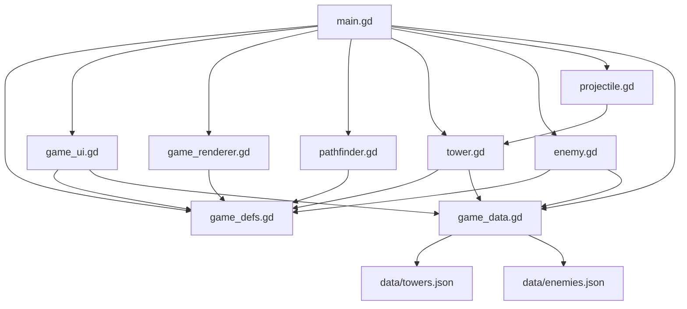

# Path Bender Tower Defense - 遊戲邏輯說明

本文說明目前 `Beta 0.5.5` 的主要運行流程、檔案職責，以及 `main.gd` 與其他 `.gd` 檔案之間的調用關係。目標是讓後續調整畫面精細度、塔造型、子彈、敵人種類、場景與數值平衡時，可以快速找到該改哪裡。

## 專案概覽

核心玩法：

- 敵人從左側入口往右側出口移動。
- 玩家建造 2x2 塔來改變敵人路線。
- 建塔可以延長路徑，但不能完全堵死入口到出口。
- 敵人可 8 方向移動，包含斜線，但不能斜穿過被塔封住的角落。
- 第 50 波是最後一波，通過後勝利。

## 目前檔案職責

```text
scripts/main.gd             主流程、遊戲狀態、建塔、波次、戰鬥更新、存檔
scripts/game_defs.gd        共用常數：地圖、塔/敵人類型、畫面狀態、版本號
scripts/game_data.gd        讀取資料表，提供塔與敵人數值查詢
scripts/pathfinder.gd       路徑搜尋、防堵路、斜線移動限制
scripts/game_renderer.gd    畫面繪製：格線、路徑、塔、敵人、子彈、背景
scripts/game_ui.gd          UI 建立、按鈕連接、版面配置、HUD 文字更新
scripts/tower.gd            單座塔的資料、升級與數值套用
scripts/enemy.gd            單隻敵人的資料、速度、血量、狀態效果
scripts/projectile.gd       子彈資料：位置、目標、傷害、緩速、濺射
data/towers.json            塔數值資料表
data/enemies.json           敵人數值資料表
scenes/main.tscn            Godot 主場景
project.godot               Godot 專案設定
```

`main.gd` 是目前的遊戲中樞，但已把路徑、繪圖、UI、資料讀取、塔/敵人/子彈物件拆出去。後續若要改外觀，通常先看 `game_renderer.gd`；若要改 UI，先看 `game_ui.gd`；若要調數值，先改 `data/*.json`。

## 主調用關係



## `main.gd` 與其他檔案的連接點

`main.gd` 開頭 preload 目前主要模組：

```gdscript
const Tower = preload("res://scripts/tower.gd")
const Enemy = preload("res://scripts/enemy.gd")
const Projectile = preload("res://scripts/projectile.gd")
const Pathfinder = preload("res://scripts/pathfinder.gd")
const GameRenderer = preload("res://scripts/game_renderer.gd")
const GameUI = preload("res://scripts/game_ui.gd")
const GameData = preload("res://scripts/game_data.gd")
```

主要調用方向：

| 來源 | 呼叫 | 目的 |
|---|---|---|
| `main.gd` | `GameUI.build(self)` | 建立所有 UI panel、按鈕、文字 |
| `main.gd` | `GameUI.connect_buttons(self)` | 連接按鈕 signal 到 `main.gd` 的遊戲函式 |
| `main.gd` | `GameUI.update_layout(self)` | 根據視窗大小更新 UI 與建造區位置 |
| `main.gd` | `GameUI.show_screen(self, screen)` | 切換主選單、規則、排行榜、難度、遊戲畫面 |
| `main.gd` | `GameUI.update(self)` | 更新 HUD 文字、塔按鈕、速度按鈕、存檔按鈕狀態 |
| `main.gd` | `GameRenderer.render(self, state)` | 每次 `_draw()` 時繪製遊戲畫面 |
| `main.gd` | `Pathfinder.find_path(blocked)` | 建塔、防堵路、出生敵人前計算完整路徑 |
| `main.gd` | `Pathfinder.find_path_from(cell, blocked)` | 既有敵人重新尋路 |
| `main.gd` | `Tower.new(...)` | 建造或讀檔時建立塔物件 |
| `main.gd` | `Enemy.new(...)` | 波次生成敵人 |
| `main.gd` | `Projectile.new(...)` | 塔攻擊時建立子彈 |
| `main.gd` | `GameData.tower_cost/name(...)` | 查塔價格與名稱 |

## 啟動流程

Godot 啟動順序：

1. Godot 載入 `project.godot`。
2. `run/main_scene` 指向 `res://scenes/main.tscn`。
3. `main.tscn` 建立主節點。
4. 主節點掛載 `scripts/main.gd`。
5. Godot 呼叫 `main.gd` 的 `_ready()`。

`_ready()` 流程：

```gdscript
add_child(ui_layer)
_build_audio()
_build_ui()
_connect_ui()
_load_meta_data()
_reset_game_state()
show_screen(SCREEN_MENU)
set_process(true)
```

對外調用：

- `_build_ui()` 只是 wrapper，實際呼叫 `GameUI.build(self)`。
- `_connect_ui()` 只是 wrapper，實際呼叫 `GameUI.connect_buttons(self)`。
- `_reset_game_state()` 會清空塔、敵人、子彈，再呼叫 `find_path(blocked)`。
- `show_screen(SCREEN_MENU)` 會呼叫 `GameUI.show_screen(self, SCREEN_MENU)`。

## 每幀主流程

Godot 每幀呼叫：

```gdscript
func _process(delta: float) -> void
```

流程：

1. `_update_layout()`
   - 轉呼叫 `GameUI.update_layout(self)`。
   - 更新 `cell_size`、`grid_origin`、`grid_rect`。
2. `_update_hover_cell()`
   - 計算滑鼠目前指向的格子。
   - 檢查 2x2 佔地、是否有敵人、是否會堵死路。
   - 需要時呼叫 `find_path(test_blocked)`。
3. 如果目前是遊戲畫面且還沒結束：
   - `_update_spawn(game_delta)`
   - `_update_enemies(game_delta)`
   - `_update_towers(game_delta)`
   - `_update_projectiles(game_delta)`
4. 更新訊息倒數與出生點發光倒數。
5. `_update_ui()`
   - 轉呼叫 `GameUI.update(self)`。
6. `queue_redraw()`
   - 要求 Godot 下一次呼叫 `_draw()`。

`game_delta = delta * game_speed`，所以速度按鈕會影響敵人移動、塔攻擊、子彈移動、生成節奏。

## 畫面與 UI 流程

畫面狀態由 `current_screen` 控制：

```text
SCREEN_MENU
SCREEN_RULES
SCREEN_RANKING
SCREEN_DIFFICULTY
SCREEN_GAME
```

`main.gd` 的 `show_screen(screen)` 是 wrapper：

```gdscript
func show_screen(screen: String) -> void:
	GameUI.show_screen(self, screen)
```

`game_ui.gd` 的 `show_screen(owner, screen)` 會：

1. 設定 `owner.current_screen`。
2. 清掉 `owner.last_viewport_size`，強制重新 layout。
3. 呼叫 `update_layout(owner)`。
4. 顯示或隱藏 menu/rules/ranking/difficulty/game UI。
5. 呼叫 `update(owner)` 更新文字與按鈕狀態。
6. 呼叫 `owner.queue_redraw()`。

按鈕連接在 `GameUI.connect_buttons(owner)`：

- `開始遊戲` -> `owner.start_new_game()`
- `繼續遊戲` -> `owner.load_saved_game()`
- `操作規則` -> `owner.show_screen(SCREEN_RULES)`
- `排行榜` -> `owner.show_screen(SCREEN_RANKING)`
- `難度調整` -> `owner.show_screen(SCREEN_DIFFICULTY)`
- `下一波` -> `owner.start_wave()`
- `砲塔/箭塔/冰凍塔` -> `owner.select_build_type(...)`
- `1x/2x/3x/4x` -> `owner.set_game_speed(...)`
- `存檔` -> `owner.save_game()`
- `回主選單` -> `owner.confirm_return_to_menu()`
- `退出` -> `owner.confirm_exit_game()`

注意：`GameUI` 只負責 UI，不直接改戰鬥規則。真正開始遊戲、開始波次、建塔、存檔等行為仍在 `main.gd`。

## 繪圖流程

Godot 呼叫 `main.gd`：

```gdscript
func _draw() -> void:
	GameRenderer.render(self, {...})
```

`main.gd` 會把目前繪圖需要的狀態包成 Dictionary 傳給 `GameRenderer`，包含：

- `current_screen`
- `grid_rect`
- `grid_origin`
- `cell_size`
- `blocked`
- `current_path`
- `hover_cell`
- `hover_can_build`
- `spawn_flash_timer`
- `towers`
- `selected_tower`
- `enemies`
- `projectiles`
- `lives`

`game_renderer.gd` 的繪圖順序：

1. `draw_background_details()`
2. 如果在遊戲畫面：
   - `draw_grid()`
   - `draw_path()`
   - `draw_spawn_flash()`
   - `draw_build_preview()`
   - `draw_towers()`
   - `draw_enemies()`
   - `draw_projectiles()`
   - `draw_game_over()`
3. 如果不在遊戲畫面：
   - `draw_menu_background()`

後續要改塔造型，優先看：

```gdscript
draw_towers()
draw_cannon_tower()
draw_arrow_tower()
draw_ice_tower()
```

後續要改敵人外觀，優先看：

```gdscript
draw_enemies()
enemy_color()
draw_enemy_body()
```

後續要改子彈特效，優先看：

```gdscript
draw_projectiles()
```

## 建造系統

玩家點擊建造區時，入口在：

```gdscript
func _unhandled_input(event: InputEvent) -> void
```

左鍵流程：

```text
_unhandled_input()
-> world_to_cell(mouse_pos)
-> try_build_or_select(cell)
```

`try_build_or_select(cell)` 判斷順序：

1. 如果點到既有塔，設定 `selected_tower`。
2. 如果波次進行中，拒絕建造。
3. `can_place_footprint(cell)` 檢查 2x2 佔地是否在地圖內且未被占用。
4. `tower_cost(selected_build_type)` 查資料表價格。
5. 金幣不足則 `reject_build(...)`。
6. `footprint_has_enemy(cell)` 檢查欲建造區塊是否有敵人。
7. 複製 `blocked` 成 `test_blocked`。
8. 把欲建造的 2x2 區塊加入 `test_blocked`。
9. 呼叫 `find_path(test_blocked)`。
10. 如果無路，拒絕建造並播放錯誤音。
11. 建立 `Tower.new(cell, selected_build_type)`。
12. 將塔加入 `towers`。
13. 更新 `blocked` 與 `current_path`。
14. 扣金幣並呼叫 `retarget_live_enemies()`。

與其他檔案的關係：

- `Tower.new(...)` 進入 `tower.gd`。
- `tower.gd` 透過 `GameData.tower(type_id)` 讀 `data/towers.json`。
- `find_path(...)` 轉呼叫 `Pathfinder.find_path(...)`。
- `reject_build(...)` 會播放 `error_audio`。

## Hover 建造預覽

每幀由 `main.gd` 呼叫：

```gdscript
func _update_hover_cell() -> void
```

流程：

1. 不是遊戲畫面就清空 hover。
2. 滑鼠不在建造區就清空 hover。
3. 設定 `hover_cell`。
4. 呼叫 `can_place_footprint()` 與 `footprint_has_enemy()`。
5. 如果初步可建造，模擬加入 `test_blocked`。
6. 呼叫 `find_path(test_blocked)` 檢查不會堵死路。
7. 設定 `hover_can_build`。

繪製在 `game_renderer.gd`：

```gdscript
draw_build_preview()
```

可建造顯示藍色半透明 2x2，不可建造顯示紅色半透明 2x2。

## 路徑系統

`main.gd` 保留 wrapper：

```gdscript
func find_path(block_map: Dictionary) -> Array[Vector2i]:
	return Pathfinder.find_path(block_map)

func find_path_from(start_cell: Vector2i, block_map: Dictionary) -> Array[Vector2i]:
	return Pathfinder.find_path_from(start_cell, block_map)
```

真正邏輯在 `pathfinder.gd`：

```gdscript
static func find_path(block_map: Dictionary) -> Array[Vector2i]
static func find_path_from(start_cell: Vector2i, block_map: Dictionary) -> Array[Vector2i]
static func is_inside_grid(cell: Vector2i) -> bool
static func is_diagonal_blocked(current: Vector2i, dir: Vector2i, block_map: Dictionary) -> bool
```

用途：

- 建塔前檢查是否堵死路。
- 開局與讀檔後建立 `current_path`。
- 出生敵人前取得目前路徑。
- 建塔或拆塔後讓場上敵人重新尋路。

斜線移動規則：

- 允許 8 方向移動。
- 若要走斜線，會檢查水平相鄰格與垂直相鄰格。
- 如果兩側角落被堵住，就不允許斜穿。

## 波次與敵人生成

按下 `下一波`：

```text
GameUI 按鈕 signal
-> main.gd start_wave()
```

`start_wave()` 流程：

1. 如果 `is_wave_active()` 為 true，不能開始。
2. 如果已經通過 `FINAL_WAVE`，設定勝利。
3. `wave += 1`。
4. 每 10 波設定 Boss。
5. 設定本波要生成的敵人數量。
6. 播放提示音。
7. 設定 `spawn_flash_timer`，讓出生點發光。

每幀生成流程：

```text
_process()
-> _update_spawn(game_delta)
-> spawn_enemy(is_boss, enemy_type)
```

`spawn_enemy()` 流程：

1. 呼叫 `find_path(blocked)`。
2. 如果無路，取消生成。
3. 設定 `current_path`。
4. 用路徑第一格取得出生座標。
5. 建立 `Enemy.new(path, start_pos, wave, is_boss, enemy_type, hp_multiplier, speed_multiplier)`。
6. 加入 `enemies`。

`enemy_type_for_spawn(spawn_index)` 決定一般敵人種類：

- 前期主要是 basic。
- 中後期會混入 fast 與 tank。
- Boss 波另外由 `start_wave()` 控制。

## 敵人系統

敵人物件在：

```text
scripts/enemy.gd
```

建立敵人時：

```text
main.gd spawn_enemy()
-> Enemy.new(...)
-> enemy.gd _init(...)
-> GameData.enemy_base()
-> GameData.enemy(type_id) 或 GameData.boss()
-> data/enemies.json
```

`enemy.gd` 主要資料：

- `path`
- `index`
- `pos`
- `base_speed`
- `hp`
- `max_hp`
- `reward`
- `is_boss`
- `type_id`
- `name`
- `body_color`
- `slow_timer`
- `slow_factor`
- `hit_flash_timer`

主要函式：

```gdscript
func current_speed() -> float
func apply_hit_flash() -> void
func apply_slow(factor: float, duration: float) -> void
func tick_status(delta: float) -> void
```

敵人移動仍由 `main.gd` 控制：

```gdscript
func _update_enemies(delta: float) -> void
```

流程：

1. 呼叫 `enemy.tick_status(delta)` 更新受擊閃爍與緩速。
2. 如果抵達終點，扣生命並移除敵人。
3. 朝 `enemy.path[enemy.index + 1]` 的中心點移動。
4. 生命小於等於 0 時給玩家金幣。
5. 如果死亡的是 Boss，更新排行榜。
6. 第 50 波結束且敵人清空後設定 `game_won = true`。

## 塔系統

塔物件在：

```text
scripts/tower.gd
```

建立塔時：

```text
main.gd try_build_or_select()
-> Tower.new(cell, selected_build_type)
-> tower.gd _init(...)
-> tower.gd _apply_stats()
-> GameData.tower(type_id)
-> data/towers.json
```

讀檔時：

```text
main.gd load_saved_game()
-> Tower.new(tower_cell, saved_type, saved_level)
```

升級時：

```text
main.gd upgrade_selected_tower()
-> selected_tower.upgrade()
-> tower.gd _apply_stats()
```

`tower.gd` 主要資料：

- `cell`
- `type_id`
- `name`
- `cooldown`
- `level`
- `cost`
- `range`
- `fire_rate`
- `damage`
- `target_count`
- `splash_radius`
- `slow_factor`
- `slow_duration`
- `color`

主要函式：

```gdscript
func upgrade_cost() -> int
func upgrade() -> void
func _apply_stats() -> void
```

塔攻擊仍由 `main.gd` 控制：

```gdscript
func _update_towers(delta: float) -> void
```

流程：

1. 每座塔扣 `cooldown`。
2. 冷卻未結束就跳過。
3. 呼叫 `enemies_for_tower(tower)` 找目標。
4. 對每個目標建立 `Projectile.new(tower_center(tower), target, tower)`。
5. 重設 `tower.cooldown = tower.fire_rate`。
6. 呼叫 `play_tower_sound(tower.type_id)`。

目標選擇：

```gdscript
func enemies_for_tower(tower: Tower) -> Array[Enemy]
```

目前會找射程內敵人，並依路徑進度排序，優先攻擊較接近終點的敵人。

## 子彈與傷害

子彈物件在：

```text
scripts/projectile.gd
```

建立子彈時：

```text
main.gd _update_towers()
-> Projectile.new(tower_center, target, tower)
-> projectile.gd _init(...)
```

`projectile.gd` 從來源塔複製：

- `damage`
- `tower_type`
- `splash_radius`
- `slow_factor`
- `slow_duration`
- `color`

子彈移動：

```gdscript
func _update_projectiles(delta: float) -> void
```

流程：

1. 如果目標敵人已不存在，移除子彈。
2. 朝目標敵人位置移動。
3. 距離足夠近時呼叫 `_apply_projectile_hit(projectile)`。
4. 移除命中的子彈。

命中處理：

```gdscript
func _apply_projectile_hit(projectile: Projectile) -> void
```

砲塔：

- 如果有 `splash_radius`，對範圍內敵人造成濺射傷害。

箭塔：

- 單體高攻速。
- 高等級後 `target_count` 增加，因此一次可建立多個子彈。

冰凍塔：

- 命中後造成傷害。
- 呼叫 `enemy.apply_slow(projectile.slow_factor, projectile.slow_duration)`。

## 數值資料化

塔數值：

```text
data/towers.json
```

敵人數值：

```text
data/enemies.json
```

讀取入口：

```text
scripts/game_data.gd
```

主要函式：

```gdscript
static func tower(type_id: String) -> Dictionary
static func enemy(type_id: String) -> Dictionary
static func enemy_base() -> Dictionary
static func boss() -> Dictionary
static func tower_name(type_id: String) -> String
static func tower_cost(type_id: String) -> int
```

調用關係：

- `tower.gd` 使用 `GameData.tower(type_id)` 套用塔數值。
- `enemy.gd` 使用 `GameData.enemy_base()` 與 `GameData.enemy(type_id)` 套用敵人數值。
- Boss 使用 `GameData.boss()`。
- `main.gd` 的 `tower_cost()` / `tower_name()` 轉呼叫 `GameData`。
- `game_ui.gd` 的塔按鈕文字也從 `GameData` 讀價格與名稱。

調平衡時優先改 JSON：

- 塔價格：`data/towers.json` 的 `cost`
- 塔傷害：`damage`、`damage_per_level`
- 塔射程：`range`、`range_per_level`
- 塔攻速：`fire_rate`、`fire_rate_per_level`、`min_fire_rate`
- 敵人血量：`data/enemies.json` 的 `hp`、`hp_per_wave`、`hp_multiplier`
- 敵人速度：`speed`、`speed_per_wave`、`speed_multiplier`
- 敵人獎勵：`reward`、`reward_per_wave`、`reward_bonus`

## 存檔與排行榜

路徑：

```gdscript
const SAVE_PATH := "user://path_bender_save.json"
const META_PATH := "user://path_bender_meta.json"
```

重要函式：

```gdscript
func save_game() -> void
func _load_meta_data() -> void
func _read_json_file(path: String) -> Dictionary
func _save_meta_data() -> void
```

`SAVE_PATH` 保存：

- 難度
- 金幣
- 生命
- 波數
- 塔的位置、類型與等級
- Boss 排行榜

讀檔時 `load_saved_game()` 會：

1. 清空目前遊戲狀態。
2. 還原難度、金幣、生命、波數。
3. 逐筆建立 `Tower.new(...)`。
4. 重建 `blocked`。
5. 呼叫 `find_path(blocked)`。
6. 切到遊戲畫面。

`META_PATH` 保存：

- 難度
- Boss 排行榜

## Git 與 Web 部署

目前專案已納入 Git：

- commit：`70a2c00 Add Godot tower defense project`
- 追蹤範圍：`tower_defense_godot/`
- 已排除：
  - `.DS_Store`
  - Godot `.godot/` 快取
  - 舊副本 `path-bender-tower-defense-(4.4)/`

Web 匯出設定：

- 檔案：`export_presets.cfg`
- preset：`Web`
- 輸出目錄：`builds/web/`
- 輸出入口：`builds/web/index.html`
- 已安裝官方 Godot `4.6.3` Web export templates。

Netlify 測試部署：

- 首次匿名部署：
  - `https://hilarious-panda-60a585.netlify.app`
  - 密碼：`My-Drop-Site`
- 修正中文字型後重新部署：
  - `https://frabjous-dragon-091bbc.netlify.app`
  - 密碼：`My-Drop-Site`

注意：

- 匿名 Netlify deploy 需要在 60 分鐘內 claim，否則不適合當正式網址。
- 若要正式維護，建議將 Netlify site claim 到帳號，或綁定 GitHub repository。
- 之後更新流程：
  1. 修改 Godot 專案。
  2. 用 Godot Web export 重新輸出 `builds/web`。
  3. 用 Netlify CLI 或 Netlify 後台重新部署同一個 site。

## 重要函式速查

| 函式 | 位置 | 用途 |
|---|---|---|
| `_ready()` | `main.gd` | 初始化音效、UI、存檔與主選單 |
| `_process()` | `main.gd` | 每幀更新遊戲邏輯 |
| `_unhandled_input()` | `main.gd` | 處理滑鼠與鍵盤輸入 |
| `_update_layout()` | `main.gd` | wrapper，呼叫 `GameUI.update_layout()` |
| `show_screen()` | `main.gd` | wrapper，呼叫 `GameUI.show_screen()` |
| `try_build_or_select()` | `main.gd` | 建塔或選取塔 |
| `find_path()` | `main.gd` | wrapper，呼叫 `Pathfinder.find_path()` |
| `find_path_from()` | `main.gd` | wrapper，呼叫 `Pathfinder.find_path_from()` |
| `start_wave()` | `main.gd` | 開始下一波 |
| `_update_spawn()` | `main.gd` | 控制敵人生成 |
| `spawn_enemy()` | `main.gd` | 建立敵人物件 |
| `_update_enemies()` | `main.gd` | 移動敵人與處理死亡/抵達出口 |
| `_update_towers()` | `main.gd` | 控制塔攻擊 |
| `_update_projectiles()` | `main.gd` | 控制子彈移動 |
| `_apply_projectile_hit()` | `main.gd` | 處理子彈命中效果 |
| `save_game()` | `main.gd` | 存檔 |
| `_update_ui()` | `main.gd` | wrapper，呼叫 `GameUI.update()` |
| `_draw()` | `main.gd` | wrapper，呼叫 `GameRenderer.render()` |
| `render()` | `game_renderer.gd` | 主繪圖入口 |
| `build()` | `game_ui.gd` | 建立 UI |
| `connect_buttons()` | `game_ui.gd` | 連接 UI 按鈕 |
| `tower()` | `game_data.gd` | 讀塔資料 |
| `enemy()` | `game_data.gd` | 讀敵人資料 |

## 後續開發定位

## 後期版本更新要點

### Web 版效能優化

- 分層繪製：
  - 將背景格線、塔佔用地板、敵人路徑等不常變動的畫面拆成快取層。
  - 每幀只重畫敵人、子彈、衝擊波、浮動文字等動態元素。
  - 目標是降低 Godot Web 版每幀繪製成本，改善 Safari 或低效能裝置的鈍挫感。
- 降低特效負擔：
  - 控制同時存在的衝擊波、浮動文字、路徑透明疊色與其他短效動畫數量。
  - 必要時增加 Web 版專用特效等級，例如 `低 / 中 / 高`。
- 字型瘦身：
  - 目前 Web 版已內嵌 `Noto Sans TC` 修正中文字亂碼，但完整中文字型檔較大。
  - 後續可製作只包含遊戲用字的子集字型，降低首次載入大小。

想改畫面精細度：

- 優先看 `scripts/game_renderer.gd`。

想改塔造型：

- `draw_cannon_tower()`
- `draw_arrow_tower()`
- `draw_ice_tower()`

想改子彈特效：

- `draw_projectiles()`
- 必要時再改 `scripts/projectile.gd`。

想增加敵人種類：

1. 在 `game_defs.gd` 加敵人類型常數。
2. 在 `data/enemies.json` 加敵人資料。
3. 在 `main.gd` 的 `enemy_type_for_spawn()` 安排出現規則。
4. 在 `game_renderer.gd` 視需要調整外觀。

想增加塔種類：

1. 在 `game_defs.gd` 加塔類型常數。
2. 在 `data/towers.json` 加塔資料。
3. 在 `game_ui.gd` 加按鈕與 signal。
4. 在 `game_renderer.gd` 加繪製函式。
5. 在 `main.gd` 的輸入與選塔流程加入新類型。

想調整難度：

- 優先改 `main.gd` 的 `starting_gold()`、`starting_lives()`、`enemy_hp_multiplier()`、`enemy_speed_multiplier()`。
- 若是單位數值，優先改 `data/towers.json` 與 `data/enemies.json`。
